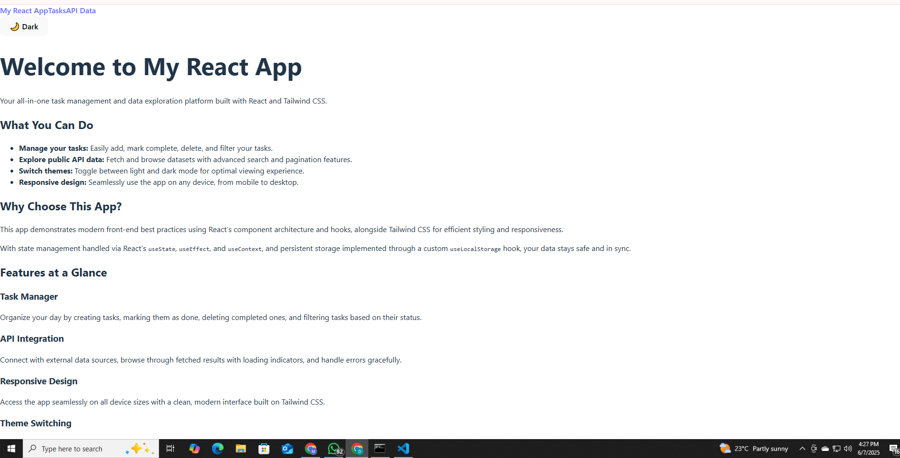
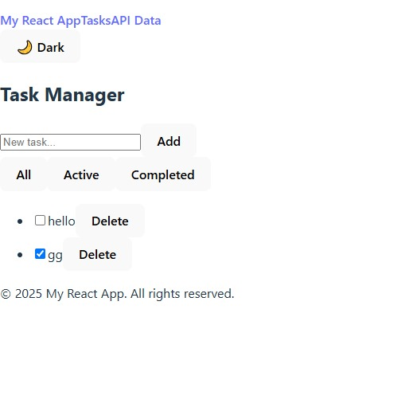
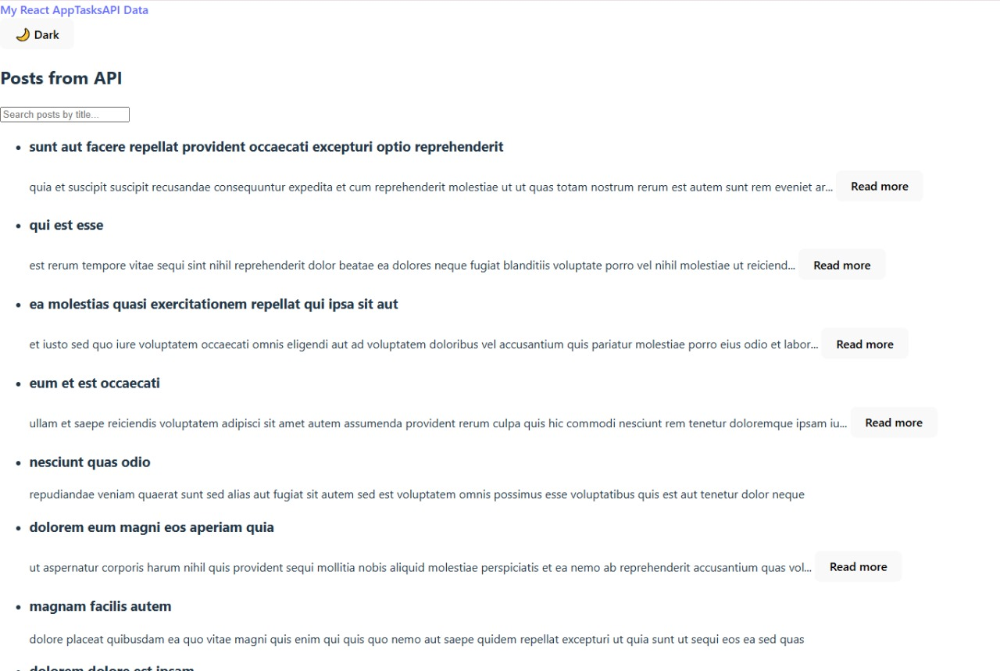

# 🎨 Week 3: React.js, JSX, and Tailwind CSS – Mastering Front-End Development

## 🚀 Objective
Build a responsive React application using JSX and Tailwind CSS that demonstrates component architecture, state management, hooks usage, and API integration.

---

## 📂 Tasks

### Task 1: Project Setup
- Create a new React application using Vite.
- Install and configure Tailwind CSS.
- Set up the project structure with components, pages, and utility folders.
- Configure basic routing using React Router.

### Task 2: Component Architecture
- Create reusable UI components:
  - Button component with different variants (primary, secondary, danger).
  - Card component for displaying content in a boxed layout.
  - Navbar component for site navigation.
  - Footer component with links and copyright information.
- Implement a layout component that includes the Navbar and Footer.
- Use props to make components customizable and reusable.

### Task 3: State Management and Hooks
- Implement a TaskManager component that allows users to:
  - Add new tasks.
  - Mark tasks as completed.
  - Delete tasks.
  - Filter tasks (All, Active, Completed).
- Use the following hooks:
  - `useState` for managing component state.
  - `useEffect` for side effects (e.g., loading saved tasks).
  - `useContext` for theme management (light/dark mode).
- Create a custom hook (e.g., `useLocalStorage`) for persisting tasks.

### Task 4: API Integration
- Fetch data from a public API (e.g., JSONPlaceholder).
- Display the fetched data in a list or grid layout.
- Implement loading and error states.
- Add pagination or infinite scrolling.
- Create a search feature to filter the API results.

### Task 5: Styling with Tailwind CSS
- Create a responsive design that works on mobile, tablet, and desktop.
- Implement a theme switcher (light/dark mode) using Tailwind's dark mode.
- Use Tailwind's utility classes for layout, spacing, typography, and colors.
- Create custom animations or transitions for interactive elements.

---

## 🧪 Expected Outcome
- A fully functional React application with multiple components.
- Proper state management using React hooks.
- API integration with loading and error handling.
- Responsive design implemented with Tailwind CSS.
- Clean, well-organized code following React best practices.

---

## 🛠️ Setup Instructions

1. Ensure you have [Node.js](https://nodejs.org/) installed (v18 or higher recommended).

2. Clone the repository:
   ```bash
   git clone <your-repo-url>
   cd <project-folder>


Install dependencies:

npm install


Start the development server:
npm run dev
Open the app in your browser at:
http://localhost:5173

📸 Screenshots

## 📸 Screenshots

### Home Page


### Task Manager


### API Data Fetching Page

